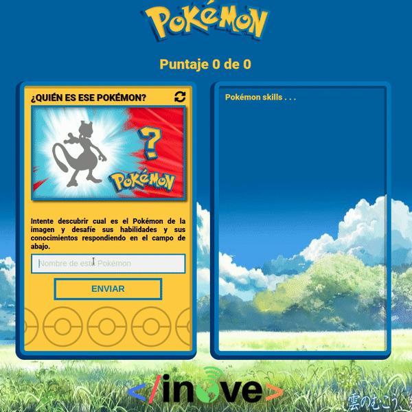

# Tarea

Para esta tarea tenemos como objetivo construir la aplicación de PokeTrivia. La aplicaciñon se irá construyendo a medida que avanzan las clases. A partir de ahora le pediremos siempre trabaje sobre el mismo repositorio donde vaya trabajando en esta aplicación (el repositorio creado a partir de la clase 7).

## Desarrollo que debe realizar
#### En archivo app.js
- Crear la función "restart". En el archivo app.js encontrará todas las instrucciones necesarias acerca de lo que debe realizar esta función.

#### En archivo events.js
- Modificar los eventos, en vez de utilizar "addEventListener" utilizar la propiedad "on-event".
- Agregar evento de "onclick" sobre el boton de "send" para evaluar el resultado de la trivia:
- * Se debe capturar el texto ingresado en el elemento "input".
- * Se debe evaluar si hay texto allí (que no se haya presionado el botón si colocar texto).
- * Si hay texto ingresado, incrementar la variable "cantidadEncuestados".
- * Evaluar si el texto ingresado es igual al nombre del pokemon según la variable "numero" y la lista de "pokemons". Recomendamos pasar tanto el texto ingresado como el nombre del pokemon a "lower case".
- * Si los nombres coinciden escribir en el texto de "resultText" un mensaje de felicitaciones. Agregar/cambiar la clase CSS del elemento "imgpokemon" a "success". Incrementar la variable "cantidadAcertados"
- * Si el texto ingresado no coincide con el nombre del pokemon, escribir en "resultText" un mensaje para notificar que el nombre ingresado no es correcto. Borrar o quitar la clase CSS "success" del elemento con ID "imgpokemon".
- * Agregar un operador ternario para modificar el estilo de la leyenda "puntaje" en función si la persona respondió correctamente el 50% de las veces. En caso de que haya respondido bien menos de la mitad de las preguntas que se realizaron (cantidadEncuestados) agregar la clase "puntajeBajo".

## Como se deberá ver su aplicación hasta el momento

#### ¡Ante cualquier duda no dude en contactar al profesor o tutor!.